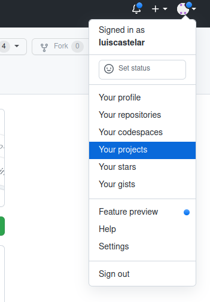

---
 DeApWeb - Despliegue de Aplicaciones Web
---

# T2 Introducción a Git

Duración: 4 horas.
*Fecha de examen: ??*

## [OFF-TOPIC] Markdown:
+ [Doc **OFICIAL**](https://www.markdownguide.org/basic-syntax)
+ [Doc español](https://markdown.es/sintaxis-markdown/)
+ [Cheat-sheet](https://www.markdownguide.org/cheat-sheet)
+ [Tablas en md](https://www.tablesgenerator.com/markdown_tables)

## Git


+ [Doc OFICIAL](https://git-scm.com/docs)
+ [Tutorial básico Hostinger](https://www.hostinger.es/tutoriales/comandos-de-git)
+ [Libro - Pro Git](https://git-scm.com/book/en/v2)
+ [Otros libros y apuntes de interés](https://i123.duckdns.org)
+ [Resetear history](https://whitep4nth3r.com/blog/rewrite-git-history/)

### Vídeos
+ [Pelao Nerd - 1](https://youtu.be/kEPF-MWGq1w)
+ [Pelao - 2](https://youtu.be/7-JHoPyJy-Q)

## Ejercicio
Seguir las indicaciones del vídeo para captar los pasos básicos de git:
1. Configurar los --global:
```
git config --global user.name "nombre"
git config --global user.mail "email_alumno@iescastelar.com"
```
2. Crear un repositorio en un directorio vacío `git init`
3. Comprendiendo relación *dir_trabajo - staging - repositorio (local)*
   - Nosotros sólo podemos modificar los archivos del *directorio de trabajo*
   - Debemos añadirlos (`git add ARCHIVOS`) al *stage area* (zona de paso) para realizar el seguimiento de los cambios. \
     Una vez añadidos, *git* realiza un seguimiento de sus cambios.
   - Debemos realizar *commit* (`git commit -m "Texto"`) para validar el cambio de los archivos **rastreados** y por tanto pasarlo al repositorio (local). Con `git commit -a` validaremos *TODOS* los archivos con seguimiento. Los rastreados y los que no TAMBIÉN.
```
nano README.md
git status
git add .
git commit -m "Inicializo proyecto Git"
git status
```
4. Comprobar la direfencia entre `git rm --cache ARCHIVO` y `git rm ARCHIVO`
5. Comprendiendo relación *repositorio local - repositorio remoto*
   - Creo repositorio remoto. *Mejor vacío sin README ni licencia*.
   - Añado repositorio remoto a mi git:
     1. Añadimos una rama con `git branch -M RAMA` (la inicial normalmente main o master).
     2. Añadirmos el remoto con `git remote add origin git@github.com:USUARIO_GIT/REPOSITORIO.git`, donde el REPOSITORIO del USUARIO_GIT debe existir.
   - Sincronización:
     + Iniciarla con `git push -u origin RAMA`
     + Hacia abajo: `git pull`.
     + Hacia arriba: `git push`\
     > Lo normal es comenzar el día con un `git pull` y acabarlo con un `git push` ... podéis tomarlo como los buenos días y buenas noches.

> Cuando hayáis llegado al punto 5 veréis que falla... deberemos primero depositar nuestra llave pública en el repositorio remoto.

### Merge y rebase
¿Qué ocurre cuando trabajamos con ramas o hemos realizado cambios desde 2 equipos distintos? \


Pues que tenemos que unir los caminos. Tenemos 2 opciones: merge y rebase.
+ **git merge** crea un commit *MERGE* de unión de ambas ramas.
+ **git rebase** crea un commit *REBASE* que contiene los commits de la línea temporal alternativa y elimina la elimina. Como si nunca hubiera existido, pero con el mismo resultado qeu el `merge`. \
  *Ventaja*: Visualmente más sencillo ya que el histrial aparece lineal. \
  *Inconveniente*: Los creadores de los commits que desaparecen pierden el seguimiento de sus cambios por los HASH. \


## Método Kanban


Personalmente me gustan las columnas: To-Do, Working, Waiting, Done y Cancel.

[Uso con github](https://docs.github.com/es/issues/planning-and-tracking-with-projects/creating-projects/creating-a-project)

### Pasos:
1. Ir a mis proyectos: \

2. Crear proyecto nuevo: \

3. Tipo *Kanboard* (tablero *Kanban*): \


## PRÁCTICA
1. Create una cuenta en github (con el email corporativo).
2. Crea un repositorio privado (vacío).
3. Sigue los pasos que te proporciona para crear un git local o subir uno existente.
4. Crea un README.md con:
   + Autor del repositorio
   + eMail de contacto (corporativo)
   + Módulos a revisar (los que te imparto)
5. Crea un subdirectorio con NOMBRE-DEL-MÓDULO
   + Crea un README.md con listado de tareas y su estado (método Kanban).
   + Crea un archivo *md* con nombre T1-PracticaGit.md
6. En otra carpeta, clona tu repositorio remoto.
   + Captura de pantalla.
   + Súbela a ./img
   + Enlázala a T1-PracticaGit.md
7. Invítame (@luiscastelar) a colaborar.
8. Marca la práctica 1 como "en espera"

### Examen
